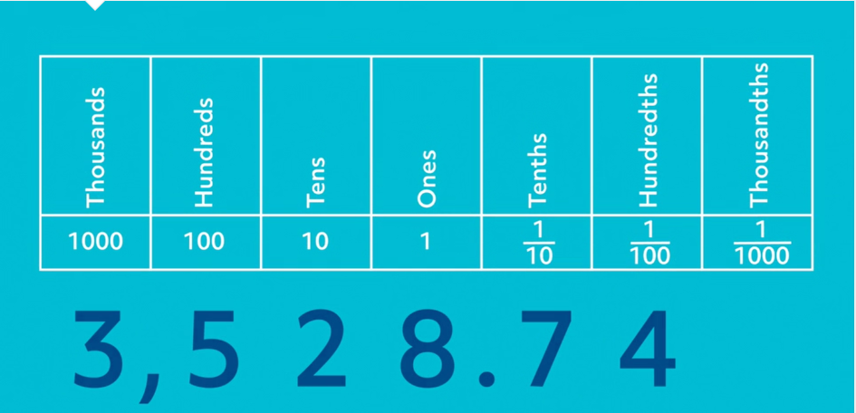
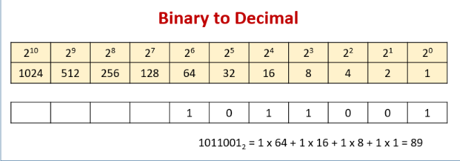

# Computer Math versus Human Math
---
Name: Andrew Marcou  
Topic: Floating Point Arithmetic  
Title: Computer Math versus Human Math
----

## Introduction
  If I were to give you a simple math problem, say "What is 0.1 + 0.2?", you would be able to solve it with no issues, responding with "0.3, of course". Clearly, that is the correct answer, right? This follows the basic math principles that we humans have learned and followed for our entire existence. To avoid existential crisis, yes, 0.3 is the correct answer, but arriving at that conclusion is often taken for granted, especially when we are referring to computers, which operate in an entirely different mathematical manner than we do. 

### Let's start with what we are used to - Human Numbers

Humans operate on base-10, or the decimal system. This means that numbers can have integer values ranging from 1-9, and the position of that number is based on powers of 10. Each number position moving from right to left is 10 times the position to its right. Digits to the left of the decimal are representative of values greater than or equal to 1, while values to the right are representative of values less than 1. This gives us the system that we use every day. 

  

In this system, adding is done exactly how we are used to. If we were given an addition problem such as:

|   | +1|   |   |
|---|---|---|---|
|   | 2 | 5 | 1 |
| + | 4 | 6 | 3 |
|---|---|---|---|
|   | 7 | 1 | 4 |

we are always taught to "carry the one". This refers to the fact that the addition taking place in a specific column runs out of integers 1-9, and must pass a value of 1 to the next column to the left, meaning a "movement up" in order of magnitude. The process for subtraction is also very similar in base-10.

Multiplication also operates in a simple manner. Multiplication is carried out column by column, and multiplying values in more left-ward columns will cause a shift in the magnitude of the product by a power of 10. Nuumbers are still "carried" and added to their respective columns similar to addition. For example:

  
|   |   |   |   |   |   |
|---|---|---|---|---|---|
|   |   |   | 2 | 5 | 1 |
|   |   | x | 4 | 6 | 3 |
|   |   |---|---|---|---|
|   |   |   | 7 | 5 | 3 |
|   | 1 | 5 | 0 | 6 | 0 |
| 1 | 0 | 0 | 4 | 0 | 0 |
|---|---|---|---|---|---|
| 1 | 1 | 6 | 2 | 1 | 3 |

### Why computer numbers are different
Though many take it for granted, the human mind is incredibly complex and is seemingly impossible to replicate. Consequently, it is very hard for a computer to operate in base-10. Luckily, due to the way its transistors operate, a computer operates very efficiently in base-2 arithmetic. Base-2 means the computer only has 2 digits to work with, unlike the 10 digits that base-10 utilizes. Each position value is determined by the integer 1 or 0, and the position location is determined by powers of 2. For example, the number 5 in base-2 arithmetic is expressed as 101.

  

In regards to adding binary numbers, there are 3 simple rules:  
* 0 + 0 = 1
* 0 + 1 = 1
* 1 + 1 = 10 (and the 1 is "carried" to the next left column)

For Example:

  
|   | +1| +1| +1|   |
|---|---|---|---|---|
|   |   | 1 | 0 | 1 |
|   | + | 1 | 1 | 1 |
|---|---|---|---|---|
|   | 1 | 1 | 0 | 0 |

Fortunately, binary multiplication works in the same manner as decimal.

## Floating Point Numbers
## Floating-Point Arithmetic
### Addition and Subtraction
### Multiplication and Division
