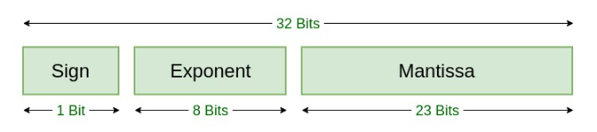
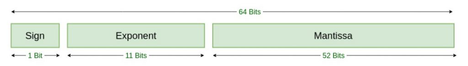

# Human Math vs. Computer Math
---
Name: Andrew Marcou  
Topic: Floating Point Arithmetic  
Title: Human Math vs. Computer Math
---- 
## Table of Contents  
[Introduction](#Introduction)   
- [Human Numbers](#Human-Numbers)  
- [Why computer numbers are different](#Why-computer-numbers-are-different)

[Floating Point Numbers](#Floating-Point-Numbers)  
- [The Basics of Floating-Point Numbers](#The-Basics-of-Floating-Point-Numbers)  
- [Computers Use Floating Point Number Systems](#Computers-Use-Floating-Point-Number-Systems)

[Floating-Point Arithmetic](#Floating-Point-Arithmetic)   
- [Addition and Subtraction](#Addition-and-Subtraction)  
- [Multiplication](#Multiplication)  
- [Division](#Division)  
- [Errors: How they grow and how to prevent them](#Errors-How-they-grow-and-how-to-prevent-them)  
- [Catastrophic Cancellation](#Catastrophic-Cancellation)

[References](#References)  
## Introduction
  If I were to give you a simple math problem, say "What is 0.1 + 0.2?", you would be able to solve it with no issues, responding with "0.3, of course". Clearly, that is the correct answer, right? This follows the basic math principles that we humans have learned and followed for our entire existence. To avoid existential crisis, yes, 0.3 is the correct answer, but arriving at that conclusion is often taken for granted, especially when we are referring to computers, which operate in an entirely different mathematical manner than we do. 

### Human Numbers

Let's start with what we are used to... Human Numbers. Humans operate on base-10, or the decimal system. This means that numbers can have integer values ranging from 1-9, and the position of that number is based on powers of 10. Each number position moving from right to left is 10 times the position to its right. Digits to the left of the decimal are representative of values greater than or equal to 1, while values to the right are representative of values less than 1. This gives us the system that we use every day. 

  
  
via: https://mathematicalmysteries.org/decimal-number-system/

In this system, adding is done exactly how we are used to. If we were given an addition problem such as:

|   | +1|   |   |
|---|---|---|---|
|   | 2 | 5 | 1 |
| + | 4 | 6 | 3 |
|---|---|---|---|
|   | 7 | 1 | 4 |

we are always taught to "carry the one". This refers to the fact that the addition taking place in a specific column runs out of integers 1-9, and must pass a value of 1 to the next column to the left, meaning a "movement up" in order of magnitude. The process for subtraction is also very similar in base-10.

Multiplication also operates in a simple manner. Multiplication is carried out column by column, and multiplying values in more left-ward columns will cause a shift in the magnitude of the product by a power of 10. Numbers are still "carried" and added to their respective columns similar to addition. For example:

  
|   |   |   |   |   |   |
|---|---|---|---|---|---|
|   |   |   | 2 | 5 | 1 |
|   |   | x | 4 | 6 | 3 |
|   |   |---|---|---|---|
|   |   |   | 7 | 5 | 3 |
|   | 1 | 5 | 0 | 6 | 0 |
| 1 | 0 | 0 | 4 | 0 | 0 |
|---|---|---|---|---|---|
| 1 | 1 | 6 | 2 | 1 | 3 |

### Why computer numbers are different
Though many take it for granted, the human mind is incredibly complex and is seemingly impossible to replicate. Consequently, it is very hard for a computer to operate in base-10. Luckily, due to the way its transistors operate, a computer operates very efficiently in base-2 arithmetic. Base-2 means the computer only has 2 digits to work with, unlike the 10 digits that base-10 utilizes. Each position value is determined by the integer 1 or 0, and the position location is determined by powers of 2. For example, the number 5 in base-2 arithmetic is expressed as 101.

  
  
via: https://www.onlinemathlearning.com/binary-number-system.html

In regards to adding binary numbers, there are 3 simple rules:  
* 0 + 0 = 1
* 0 + 1 = 1
* 1 + 1 = 10 (and the 1 is "carried" to the next left column)

For Example:

  
|   | +1| +1| +1|   |
|---|---|---|---|---|
|   |   | 1 | 0 | 1 |
|   | + | 1 | 1 | 1 |
|---|---|---|---|---|
|   | 1 | 1 | 0 | 0 | 

Fortunately, binary multiplication works in the same manner as decimal where
* 0 x 0 = 0
* 0 x 1 = 0
* 1 x 1 = 1

## Floating Point Numbers

Now that we understand the basics of base-10 versus base-2, we can now look at how a computer stores and uses its base-2 data. Firstly, we must look at a case in which a human is asked to write the number 8 billion. They may write:

$$
\begin{align*}
8,000,000,000 
\end{align*}
$$

or   

$$
\begin{align*}
8.0 * 10^9
\end{align*}
$$

The first option takes up a lot of space, and though it is a very intuitive solution, it is very inefficient for very large and very small numbers. This way of writing numbers is referred to as a fixed-point system. The second option, also known as scientific notation, follows a floating point system in which the decimal position is determined by the power of 10 multiplier to the far right. Here, the numbers to the right of the decimal are not necessarily smaller than 1 due to the multiplier. Because of its efficiency in storing very large and very small values, computers use the floating point system for their binary numbers. 

### The Basics of Floating-Point Numbers

Floating point numbers are represented in a computer with three main parts:
* The sign of the number
* The mantissa - the number itself
* The exponent - the multiplier for the number to move the decimal 

A floating-point number is said to be normalized if the leading integer of the mantissa contains a number that satisfies 1 ≤ m < β where β is the base that we are operating in (modern computers use β = 2).

### Computers Use Floating Point Number Systems 
Because of its efficiency in being able to store a wide range of values, computers utilize the IEEE 754 Floating-Point Standard. 1 "bit" represents a 0 or a 1, and a "byte" represents eight zeros or ones. It is important to note that due to the limited space of a computer, the values of numbers are limited to a certain number of digits as well. This means that many numbers are approximated by the binary conversion.

Below is a visualization for IEEE 754 Floating Point Standard for Single Precision
  
  
via: https://www.geeksforgeeks.org/ieee-standard-754-floating-point-numbers/

Below is a visualization for IEEE 754 Floating Point Standard for Double Precision

   
via: https://www.geeksforgeeks.org/ieee-standard-754-floating-point-numbers/

Again due to the limited capacity of the floating-point system, not all numbers are representable. If such is the case, then the number will be approximated to a nearby floating point number. This process is referred to as rounding and introduces the important topic of rounding error. Two methods of rounding are commonly used.
* Chopping - removing the "extra" bits of a number and leaving the rest as is; also referred to as rounding toward zero
* Round to Nearest - rounds to the closest floating point number, up or down.  
Round to nearest is the most accurate method and is the default within the IEEE system. 

This again raises an important topic, machine epsilon or εmach. Machine epsilon is the accuracy of the floating-point system. In other words, εmach is the smallest possible value that a computer can notice. Any smaller and it will identify that number as 0. For IEEE floating point systems:

* εmach = $2^{-24} \approx 10^{-7}$ in single precision (7 digits of precision in decimal)
* εmach = $2^{-53} \approx 10^{-16}$ in double precision (16 digits of precision in decimal)

To summarize, the floating-point system is utilized to store/represent a much larger range of values than fixed-point systems. Of course, there are many floating-point systems that contain different standards, but for the purpose of simplicity, we deal with the IEEE 754 floating-point system and its utilization with base-2 numbers.

## Floating-Point Arithmetic

With all of the necessary prerequisites out of the way, we can begin discussing how basic math is carried out within computers, and where crazy errors can come from if one is not careful. Recall from the introduction the alluded statement that 0.1 + 0.2 &ne; 0.3 when the calculation is done using a computer. This is due to the binary approximation of 0.1 and 0.2 not being able to fit within the limited space of the floating-point number. To clear things up, we know that in decimal:
$$\frac{1}{3} = 0.\overline{3}$$
The link above the 0.3 represents the fact that we know those 3's continue for infinity. Unfortunately, we cannot write infinite 3's, and therefore, we need an approximation. We can then write
$$\frac{1}{3} \approx 0.333$$
$$\therefore 0.333 + 0.333 + 0.333 = 0.999 < 1$$
It is here where the rounding error is introduced. Of course, we know that 0.999 is incredibly close to 1 and so we consider them to be equivalent. But a computer cannot make that connection, and therefore correctly deems them unequal. 

Now let us consider how 0.1 is approximated in base-2. Because base-2 only recognizes halves, fourths, eighths, and so on, a tenth is very difficult to approximate. 
$$\frac{1}{10} = 0.0\overline{0011} \text{   and   } \frac{2}{10} = 0.\overline{0011}$$
Again, due to limited computer space, these values are approximated
$$\frac{1}{10} \approx 0.000110011001100 \text{   and   } \frac{2}{10} = 0.001100110011001$$
$$\therefore 0.000110011001100 + 0.001100110011001 = 0.299957275390625 < 0.3$$
Again, the rounding error shows up.

Errors also show up when values are especially small or large and will be discussed later in this section, but for now, let us look at how the floating-point system operates in standard arithmetical operations.

### Addition and Subtraction
Because addition and subtraction follow very similar processes, they will be discussed in one section. When adding and subtracting floating-point numbers, the exponents must match, otherwise, the addition cannot take place. To account for this, the exponent of the smaller number is raised to that of the larger number and the mantissa is adjusted accordingly. After this process occurs, the numbers are added in the standard manner, and the exponent is attached back onto the number. For example:

### Multiplication

### Division

### Errors: How they grow and how to prevent them

### Catastrophic Cancellation

# References
